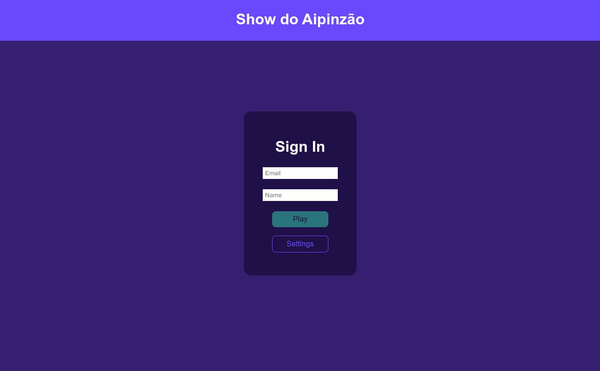
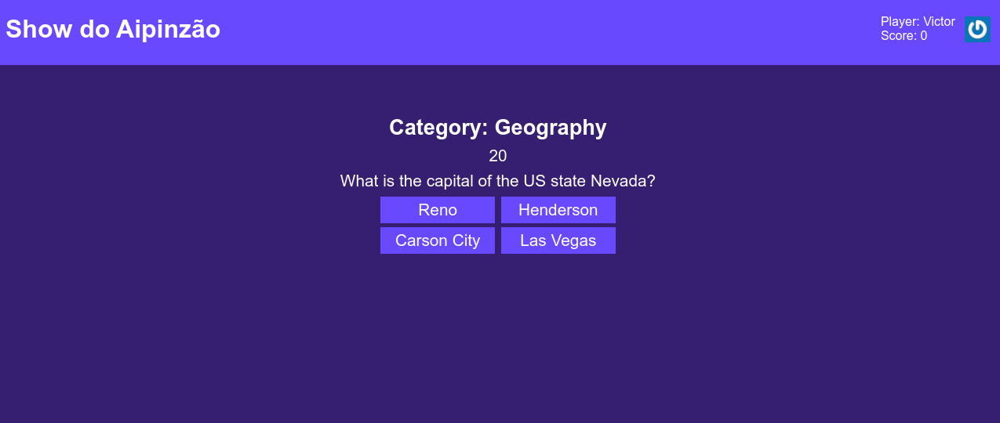
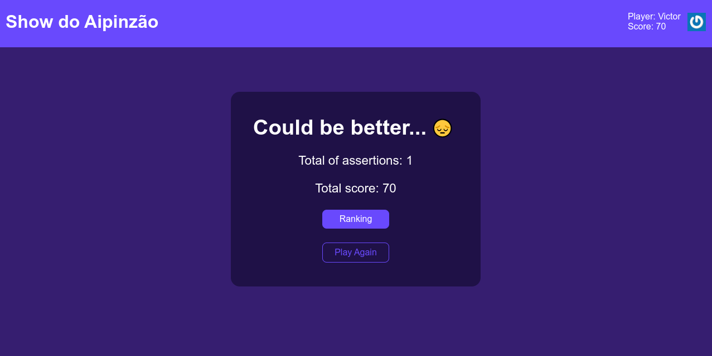
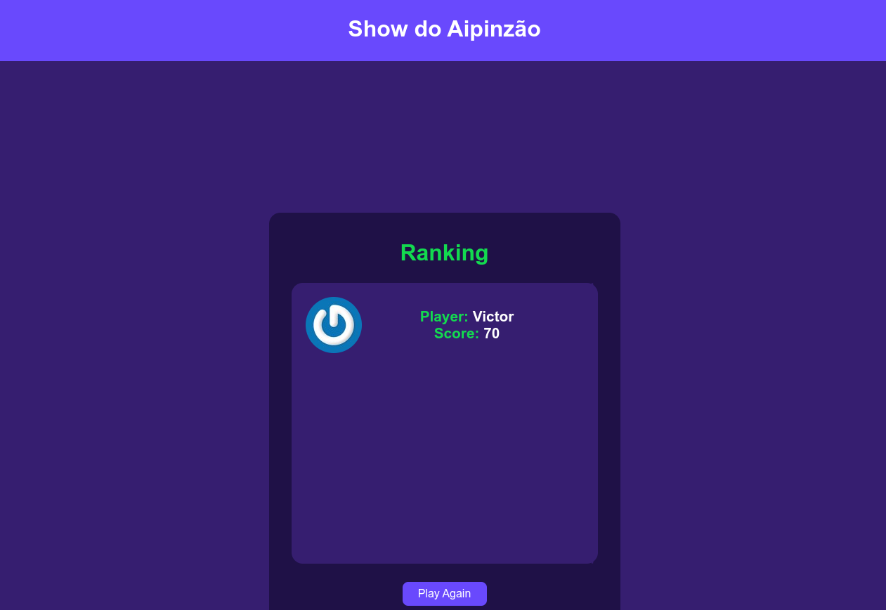

# Trivia Game

## Introdução
Um projeto de um jogo de perguntas, tipo Show do Milhão, feito para treinar o inglês.

Esse projeto foi feito em conjunto com
[Vinicius Castelo Branco](https://github.com/Vinicastelobranco), [Henos Vinicius](https://github.com/Henos19), [Ítalo Rezende](https://github.com/italorg), [Heitor Fernandes](https://github.com/heitorsfernandes).

Todos os integrantes do grupo tiveram participação na lógica do projeto. Já o css foi feito por mim e o Henos.

## Como utilizar
Na tela inicial você tem duas opções, fazer o login ou mudar o tipo de pergunta que você irá receber.

Em um primeiro uso eu recomendo só fazer o login, de preferência com um email que possua gravatar, e começar a jogar.

Depois de fazer o login, você terá que responder 5 perguntas de múltipla escolha.

Após responder todas as perguntas o seu resultado será mostrado.

Bem simples, não acha?

## Link do projeto
https://trivia-game-amber.vercel.app/

## Imagens do projeto

